# Component Workflow

## Summary

This repo uses a `code-first hybrid` workflow for chart and machine-style components.

The Svelte components and shared tokens are the source of truth. Figma is the review and packaging layer.

Use this workflow for any new data-driven component or major revision.

## Workflow Diagram

```mermaid
flowchart LR
    A["New component or revision request"] --> B{"Is the concept still loose?"}
    B -->|Yes| C["Create a rough Figma sketch<br/>Focus on intent, data, and sub-elements"]
    B -->|No| D["Implement in Svelte first"]
    C --> D
    D --> E["Use shared tokens and helpers<br/>Keep geometry in the component"]
    E --> F["Add or update glossary comments<br/>Name sub-elements consistently"]
    F --> G["Validate live behavior<br/>Data, OEE math, thresholds, responsiveness"]
    G --> H["Export or refresh SVG assets<br/>Standalone, board, design-system, anatomy"]
    H --> I["Import SVGs into Figma"]
    I --> J["Review in Figma<br/>Annotate, compare, present, collect feedback"]
    J --> K{"Feedback changes the component?"}
    K -->|Yes| L["Update code first"]
    L --> E
    K -->|No| M["Component ready"]
    M --> N["Acceptance checks<br/>README/docs aligned, npm run check, npm run build"]
```

An SVG export of this workflow for Figma import lives at [src/lib/assets/figma-codex-workflow.svg](/Users/Erikhansen/Library/CloudStorage/OneDrive-HaldanConsulting/4.3%20Haldan%20Development/svg/svelte-bars/src/lib/assets/figma-codex-workflow.svg).

## Source Of Truth

Code owns:

- component behavior
- OEE math and data mapping
- threshold logic
- responsive behavior
- SVG geometry and layout relationships
- shared tokens and reusable styling rules

Figma owns:

- review boards
- annotations
- stakeholder communication
- library packaging for humans

Do not maintain a hand-edited Figma version that diverges from code.

## Workflow Steps

### 1. Concept Pass

If the component idea is still loose, sketch it in Figma at a rough block level only.

Define:

- the component goal
- the data it needs to show
- the key sub-elements
- the comparison or review context

Do not lock pixel-perfect geometry in Figma at this stage.

### 2. Build In Code First

Create or update the Svelte component in `src/lib/components`.

Rules:

- keep geometry and SVG layout math in the component file
- use shared tokens and shared styling where the styling should propagate across components
- use realistic or default live data during implementation
- make threshold and status logic real before exporting any design assets

Shared system files:

- `src/lib/styles/chart-system.css`
- `src/lib/utils/chartTheme.ts`
- `src/lib/types.ts`

### 3. Document Anatomy In Code

Every component should include glossary comments naming its sub-elements.

Examples:

- `chartShell`
- `plotFrame`
- `valueRowFrame`
- `valueRow`
- `badges`
- `assetLabel`

If a structural change affects the glossary, update the comments in the component and refresh any anatomy asset that references those names.

### 4. Export SVG Assets For Figma

After the code is visually correct, create or refresh the SVG assets in `src/lib/assets`.

Standard exports:

- one standalone SVG for the component
- one placement on a combined board if it belongs in the main library view
- one design-system board update if shared tokens changed
- one anatomy graphic if structure changed enough that labels or callouts are stale

These SVGs should be editable in Figma after import.

### 5. Review In Figma

Use Figma for:

- side-by-side comparison
- annotations and comments
- stakeholder review
- presentation boards
- component library organization

Treat Figma feedback as requested changes to the code source of truth.

### 6. Revise In Code, Then Refresh Assets

When feedback changes spacing, colors, radii, labels, or structure:

1. update the component or shared tokens in code
2. verify the live component
3. refresh the SVG exports
4. replace the prior Figma import

Do not manually patch the imported Figma vectors as the long-term version.

## What Lives Where

Shared system files own:

- color tokens
- radii
- border widths
- common shell and frame styling
- shared value-row typography
- threshold token definitions

Individual component files own:

- dimensions
- plot padding tied to geometry
- bar widths
- pie radii
- badge positions
- component-only visual behavior

Route/demo files own:

- sample data
- comparison layouts
- component showcase composition

## Standard Deliverables

Every new component should ship with these deliverables:

1. the real Svelte component
2. glossary comments inside the component
3. one standalone Figma-importable SVG export
4. one placement on the combined component board if relevant
5. one design-system update if shared tokens changed

Optional but recommended:

- anatomy SVG when the component has complex internal structure

## Acceptance Checklist

A component is ready when:

- the Svelte component works with live or default realistic data
- shared tokens are used where appropriate
- glossary comments match the rendered structure
- the SVG export visually matches the live component
- the Figma board is updated with the latest export
- `npm run check` passes
- `npm run build` passes

## Repo Paths

Use these folders consistently:

- components: `src/lib/components`
- shared styles: `src/lib/styles`
- shared helpers: `src/lib/utils`
- Figma/anatomy exports: `src/lib/assets`
- showcase page: `src/routes/+page.svelte`

## Default Rule

If you are unsure whether to start in Figma or code for a new component in this repo, start in code.
