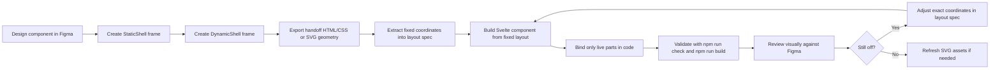

# Component Workflow

## Summary

This repo now uses a `Figma handoff + fixed-geometry code` workflow for bespoke visual components.

The source of truth is:

- Figma for `StaticShell` and `DynamicShell` geometry
- Svelte for runtime behavior and data binding

This is the default path for components that need to match Figma closely and still animate or update from live data.

## Core Rule

Split each component into two Figma handoff frames:

- `StaticShell`
- `DynamicShell`

Then rebuild the component in code from those two handoffs.

Do not try to reconstruct a component by partially tracing a flattened SVG export.

## Workflow Diagram

## What Goes In Figma

### StaticShell

`StaticShell` contains everything that never changes:

- outer shell
- plot frame
- plot surface
- title
- grid labels
- grid lines
- label chips
- default value-row shell

### DynamicShell

`DynamicShell` contains only the parts code will update:

- bars
- live values
- dynamic border

The dynamic handoff must expose:

- exact frame size
- exact x/y coordinates
- exact widths/heights
- text anchors
- bar slot positions

## Minimum Acceptable Figma Handoff

For a component to be implementable from Figma, provide:

1. One fixed-size `StaticShell` frame
2. One fixed-size `DynamicShell` frame
3. Named layers for all dynamic parts
4. Individual grid lines if the grid matters visually
5. Separate `number` and `percent` text for dynamic values
6. No outlined text for dynamic content

If any of those are missing, implementation becomes guesswork again.

## What Goes In Code

Code owns:

- data binding
- OEE math and threshold logic
- bar heights
- dynamic values
- dynamic border color
- animations
- layout spec files derived from Figma coordinates

## Layout Rule

For fidelity-sensitive components:

- use fixed internal geometry
- prefer fixed-size variants like `small`, `medium`, `large`
- do not rely on internal responsive scaling
- do not rely on shared structural CSS

Shared logic is still fine when it is truly shared, for example:

- threshold helpers
- shared types

## Shared Vs Local

Shared files should own only logic or tokens that are genuinely common:

- `src/lib/utils/chartTheme.ts`
- `src/lib/types.ts`

Component files and per-component layout specs should own:

- shell geometry
- plot geometry
- bar geometry
- label positions
- value positions
- component-specific typography sizing if needed for fidelity

## File Ownership

- components: `src/lib/components`
- component layout specs: `src/lib/components/*.layouts.ts`
- shared logic: `src/lib/utils`
- assets: `src/lib/assets`
- showcase page: `src/routes/+page.svelte`

## Standard Deliverables

For each new component built this way:

1. the real Svelte component
2. one fixed layout spec file
3. a `StaticShell` handoff
4. a `DynamicShell` handoff
5. glossary comments if the component structure is non-trivial

Optional:

- a Figma-importable SVG export of the finished live component
- an anatomy/spec asset

## Acceptance Checklist

A component is ready when:

- the Figma handoff is split into `StaticShell` and `DynamicShell`
- the Svelte component uses fixed coordinates from that handoff
- only live parts are dynamic in code
- the live component visually matches Figma
- `npm run check` passes
- `npm run build` passes

## Applies To Other Components

Yes, this workflow applies to any future bespoke component that is:

- visually custom
- geometry-sensitive
- partly static and partly data-driven

Examples:

- machine cards
- pie/donut widgets
- KPI tiles with animated fills
- status panels with fixed shells and live overlays

It is not the default for generic library charts where a charting library is more appropriate.
